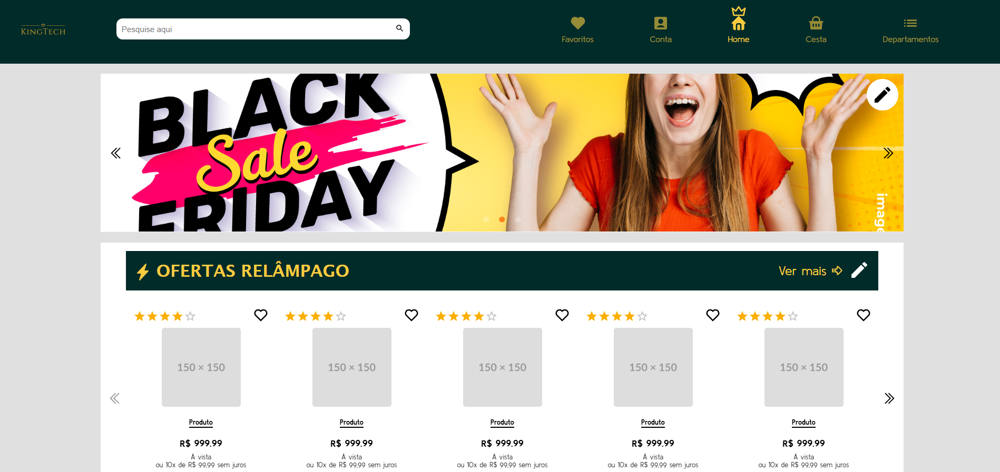

# KingTech

## 🚧 Projeto em Desenvolvimento 🚧

- Este Projeto é uma aplicação web de e-commerce de eletrônicos construída com React no frontend e Node.js no Backend.
- O objetivo é simular uma loja virtual completa com Catálogo de produtos, Carrinho, seção de favoritos, slides, busca avançada, administração e um sistema crud para produtos e usuários da loja.

## Demonstração


* [Ver o app do projeto](https://kingtech-ashy.vercel.app/)
- OBS: a API está desativada no momento, então não é possível fazer registro e login de contas.

## Estrutura do projeto 🚧 Atualmente 🚧

```
KingTech/
├── .gitattributes
├── .gitignore
├── KingTech/
│   ├── .gitignore
│   ├── README.md
│   ├── eslint.config.js
│   ├── index.html
│   ├── package-lock.json
│   ├── package.json
│   ├── public/
│   │   ├── image/
│   │   │   ├── Captura de Tela (118).png
│   │   │   ├── Captura de Tela (128).png
│   │   │   ├── Captura de Tela (132).png
│   │   │   ├── Captura de Tela (149).png
│   │   │   ├── Captura de Tela (150).png
│   │   │   ├── Captura de Tela (151).png
│   │   │   ├── Captura de Tela (152).png
│   │   │   ├── Captura de Tela (80).png
│   │   │   ├── Captura de Tela (97).png
│   │   │   ├── amd1.avif
│   │   │   ├── amd2.jpg
│   │   │   ├── amd3.png
│   │   │   ├── amd4.webp
│   │   │   ├── amd5.jpg
│   │   │   ├── amd6.webp
│   │   │   ├── amd7.webp
│   │   │   ├── amd8.jpg
│   │   │   ├── amd9.webp
│   │   │   ├── arquitetura.jpg
│   │   │   ├── banner1.webp
│   │   │   ├── banner2.jpg
│   │   │   ├── banner3.jpg
│   │   │   ├── boleto-preto.png
│   │   │   ├── boleto.png
│   │   │   ├── introduction.jpg
│   │   │   ├── kingston.webp
│   │   │   ├── kingtech.png
│   │   │   ├── perfomance.png
│   │   │   ├── quality.png
│   │   │   ├── realismo.png
│   │   │   ├── red-center-glow.avif
│   │   │   ├── ultrafast.jpg
│   │   │   └── video-streaming.avif
│   │   └── vite.svg
│   ├── src/
│   │   ├── App.css
│   │   ├── App.jsx
│   │   ├── assets/
│   │   │   └── logo.png
│   │   ├── components/
│   │   │   ├── AdminOnly.jsx
│   │   │   ├── DepartmentModal.jsx
│   │   │   ├── Footer.jsx
│   │   │   ├── Form.jsx
│   │   │   ├── Navbar.jsx
│   │   │   ├── Search.jsx
│   │   │   └── layout/
│   │   │       ├── Button.jsx
│   │   │       ├── Carrossel3D.jsx
│   │   │       ├── CarrosselOffers.jsx
│   │   │       ├── Filter.jsx
│   │   │       ├── HeartFavorite.jsx
│   │   │       ├── ProductCard.jsx
│   │   │       ├── banners/
│   │   │       │   └── BannerCarrossel.jsx
│   │   │       ├── form/
│   │   │       │   └── Select.jsx
│   │   │       └── pages/
│   │   │           ├── Cart/
│   │   │           │   ├── BasketTech.jsx
│   │   │           │   ├── ListProductsCart.jsx
│   │   │           │   ├── Steps.jsx
│   │   │           │   └── SummaryCart.jsx
│   │   │           ├── PaginationNavbar.jsx
│   │   │           └── ProductPage/
│   │   │               ├── Modals/
│   │   │               │   └── PromoConditionsModal.jsx
│   │   │               ├── Payment/
│   │   │               │   └── PaymentMethods.jsx
│   │   │               ├── Product/
│   │   │               │   └── ProductVariants.jsx
│   │   │               ├── Questions/
│   │   │               │   └── QuestionsAndAnswers.jsx
│   │   │               ├── Reviews/
│   │   │               │   ├── ReviewComments.jsx
│   │   │               │   ├── ReviewFilters.jsx
│   │   │               │   ├── ReviewSummary.jsx
│   │   │               │   └── Reviews.jsx
│   │   │               ├── Sliders/
│   │   │               │   └── ImageSlideModal.jsx
│   │   │               └── StoreAdvantages.jsx
│   │   ├── context/
│   │   │   ├── AuthContext.jsx
│   │   │   └── AuthGuard.jsx
│   │   ├── data/
│   │   │   ├── brandIcons.jsx
│   │   │   └── departmentsData.js
│   │   ├── hooks/
│   │   │   ├── useStep.jsx
│   │   │   └── useWindowWidth.jsx
│   │   ├── index.css
│   │   ├── main.jsx
│   │   ├── pages/
│   │   │   ├── account/
│   │   │   │   ├── Dashboard.jsx
│   │   │   │   ├── Login.jsx
│   │   │   │   └── Registro.jsx
│   │   │   └── departments/
│   │   │       └── DepartmentPage.jsx
│   │   ├── routes/
│   │   │   ├── Account.jsx
│   │   │   ├── Admin.jsx
│   │   │   ├── Cart.jsx
│   │   │   ├── Departments.jsx
│   │   │   ├── Error404.jsx
│   │   │   ├── Favorites.jsx
│   │   │   ├── Home.jsx
│   │   │   ├── ProductPage.jsx
│   │   │   └── Support.jsx
│   │   ├── style/
│   │   │   ├── Account.module.css
│   │   │   ├── Cart.css
│   │   │   ├── Departments.module.css
│   │   │   ├── Error404.css
│   │   │   ├── Favorites.css
│   │   │   ├── Home.css
│   │   │   ├── ProductPage.css
│   │   │   ├── Support.css
│   │   │   ├── components/
│   │   │   │   ├── DepartmentModal.css
│   │   │   │   ├── Footer.module.css
│   │   │   │   ├── Select.css
│   │   │   │   └── layout/
│   │   │   │       ├── Banner.css
│   │   │   │       ├── Carrossel3D.css
│   │   │   │       ├── CarrosselOffers.css
│   │   │   │       └── HeartFavorite.css
│   │   │   ├── pages/
│   │   │   │   ├── auth/
│   │   │   │   │   ├── Dashboard.module.css
│   │   │   │   │   ├── Login.module.css
│   │   │   │   │   └── Registro.module.css
│   │   │   │   └── departments/
│   │   │   │       └── DepartmentPage.css
│   │   │   └── responsive/
│   │   │       ├── components/
│   │   │       │   └── layout/
│   │   │       │       ├── Banner.responsive.css
│   │   │       │       └── CarrosselOffers.responsive.css
│   │   │       ├── pages/
│   │   │       │   └── departments/
│   │   │       │       └── DepartmentPage.responsive.css
│   │   │       └── routes/
│   │   │           ├── Cart/
│   │   │           │   └── Cart.responsive.css
│   │   │           ├── Favorites/
│   │   │           │   └── Favorites.responsive.css
│   │   │           ├── Home/
│   │   │           │   └── Home.responsive.css
│   │   │           └── ProductPage/
│   │   │               └── ProductPage.responsive.css
│   │   └── utils/
│   │       └── validateData.js
│   ├── vercel.json
│   └── vite.config.js
├── LICENSE
├── README.md
├── api/
│   ├── app.js
│   ├── package-lock.json
│   ├── package.json
│   └── src/
│       ├── certificates/
│       │   ├── cert.pem
│       │   ├── key.pem
│       │   └── prod-ca-2021.crt
│       ├── config/
│       │   ├── axiosConfig.js
│       │   ├── emailConfig.js
│       │   └── serverHttps.js
│       ├── controllers/
│       │   └── auth/
│       │       ├── AuthClient.js
│       │       ├── login.js
│       │       ├── logout.js
│       │       ├── me.js
│       │       ├── refresh.js
│       │       ├── register.js
│       │       └── verify.js
│       ├── middlewares/
│       │   └── supabaseAuth.js
│       ├── plugins/
│       │   └── supabaseClient.js
│       ├── routes/
│       │   └── authRoutes.js
│       ├── services/
│       │   ├── emailService.js
│       │   └── locationService.js
│       ├── templates/
│       │   ├── email.html
│       │   └── email_acess.html
│       └── utils/
│           ├── emailTemplate.js
│           ├── generateCode.js
│           ├── roles.js
│           └── validateData.js
└── jsconfig.json
```

## Tecnologias Utilizadas

### Linguagens e Markup
- HTML
- CSS
- JavaScript

### Front-End
- React.js
- Vite
- EsLint
- SWC

### Back-End
- Node.js
- Fastify
- Fastify/Cors
- Fastify/Cookies
- dotenv

### UI/Estilização
- Material UI
- Emotion
- FontAwesome

### Componentes/UI Libs
- react-router-dom
- react-icons
- react-slick
- Swiper.js
- react-spinners

### Banco de Dados
- Supabase + Postgres

### HTTP/REQUEST
- Axios

### Autenticação/Segurança
- JWT
- HIBP (HaveIBeenPwned)

### Email
- Nodemailer

### Outros
- Git
- Github
- npm
- HTTPS (certificados locais usados pelo servidor para testes)

## Funcionalidades

### Área do Usuário
- Registro e login de usuários
- Logout e manutenção de sessão com refresh token
- Verificação de e-mail
- Rota `me` para recuperar dados da sessão autenticada

### Experiência de Compra
- Listagem de produtos
- Busca e filtros de produtos
- Paginação de resultados
- Página de produto com detalhes e galeria de imagens
- Adicionar e remover itens do carrinho
- Visualização do carrinho de compras

### Navegação da Loja
- Listagem de departamentos
- Página dedicada por departamento
- Modal de navegação de categorias

### 🛠 Área Administrativa
- Rotas protegidas para administradores
- Controle de acesso baseado em roles
- Gerenciamento de produtos e departamentos (CRUD) (em progresso)

## Aprendizados

### Front-End
- Estrutura, layout e responsividade de apps web.
- criação de componentes. componentes reutilizáveis e roteamento.
- Uso de bibliotecas UI
- Trabalhar com sliders e ícones.
- props, hooks, contextos, estados e composição de componentes.
- Integração com API própria: consumo com axios e tratamento de respostas/erros.
- Noções de Autenticação do lado do cliente: consumo de endpoints, manipulação de redirecionamentos, e cookies (fluxo de sessão)
- hospedagem de apps na vercel
- configuração de ambiente com Vite e SWC

### Back-End
- Fundamentos de uma API HTTP: rotas e controladores que retornam uma resposta em JSON.
- Integração com Supabase para consultas/autorizações, conhecimento básico em bancos de dados com postgres e SQL.
- Conceitos práticos: hash de senha, envio de e-mails, uso de cookies, variáveis de ambiente e HTTPS Local.
- hospedagem de api na vercel.

## API

### endpoints
- /auth/register
- /auth/verify
- /auth/login
- /auth/me
- /auth/logout
- /auth/refresh

## Autor
- Guilherme Amorim
* [Linkedin](https://www.linkedin.com/in/guilherme-dos-santos-amorim-43b57a28b/)
* [Portfólio](https://gkptan.github.io/)
